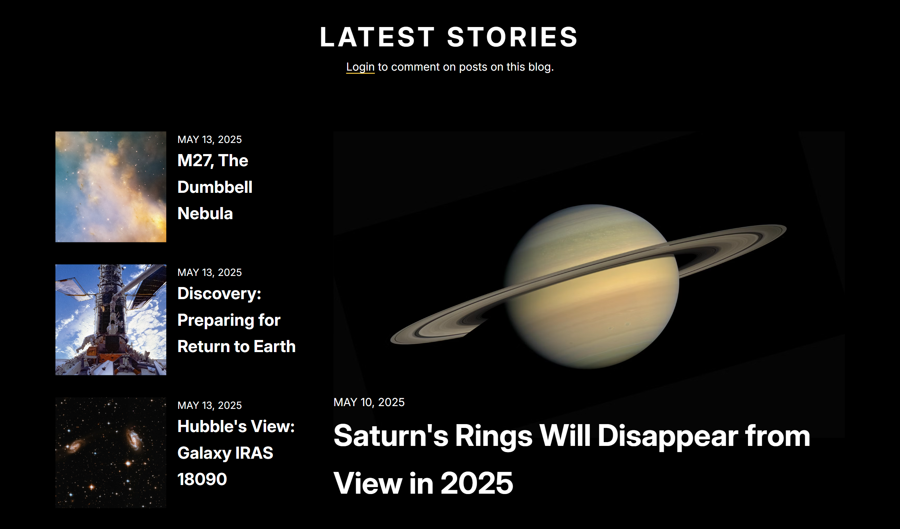
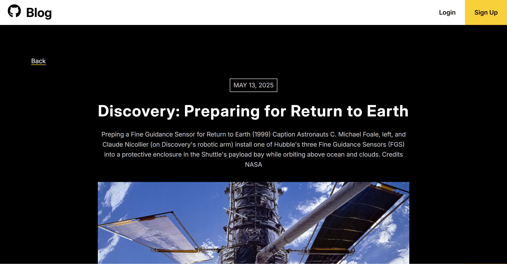
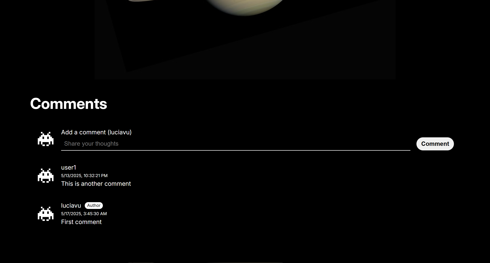

# Blog API

The Odin Project - NodeJS Course Project (5/8):

Repo (2/2) - The frontend of a full-stack blog application that consumes a custom-built RESTful API [backend](https://github.com/luciavu/blog-api).

## Tech Stack

- Frontend - React, TypeScript, SASS
- Backend - Node.Js, Express, TypeScript, Prisma ORM, PostgreSQL
- Auth: JWT
- Deployment: Vercel (Frontend) and Render + Supabase (Backend)

## Features

### Public Blog

- Fetch and display blog posts from RESTful API
  view individual post pages
- Commenting system with author display and timestamps
- Responsive UI

### Admin Dashboard

- JWT-Protected route and admin login
- CRUD operations for blog posts
- Manage user comments/permissions

## Preview

## Credits

All images + blog content from
[NASA Hubble Space Telescope ](https://unsplash.com/@hubblespacetelescope)on Unsplash.

## Links

Live link: https://blog-one-swart-70.vercel.app/

Assignment: https://www.theodinproject.com/lessons/node-path-nodejs-blog-api
